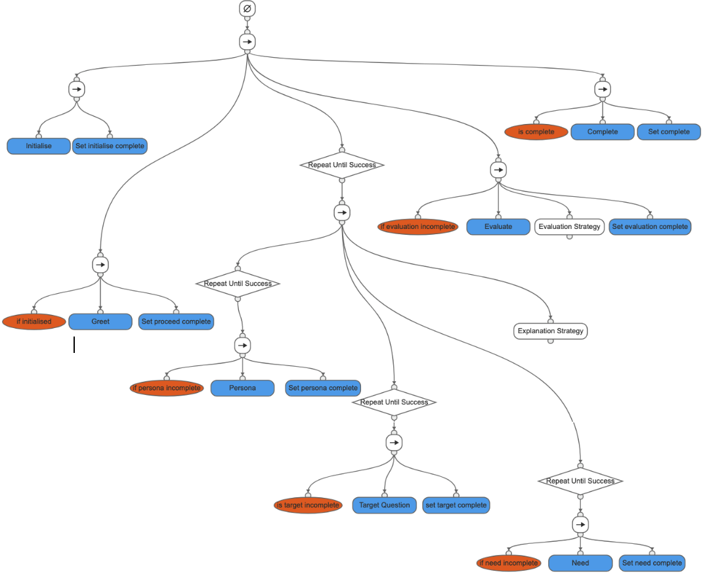

# iSee Dialogue Manager
<a href="https://doi.org/10.5281/zenodo.7734672"></a>

iSee Dialogue Manager is the back-end that implements the interactive test environment of the iSee platform. It is a Behaviour Tree engine that runs a dialogue model. The interactions are modelled as a Behaviour Tree. 

## Dialogue Model v1



## Prepare Local Environment
1. Create a fork from the iSee Repo
2. Clone the forked repo
3. Configure a python virtual environment with dependancies installed from requirements.txt
4. Run 
```bash
uvicorn main:app
``` 
5. open http://localhost:8000/ on browser to test
# iseeLLMDialogManager
